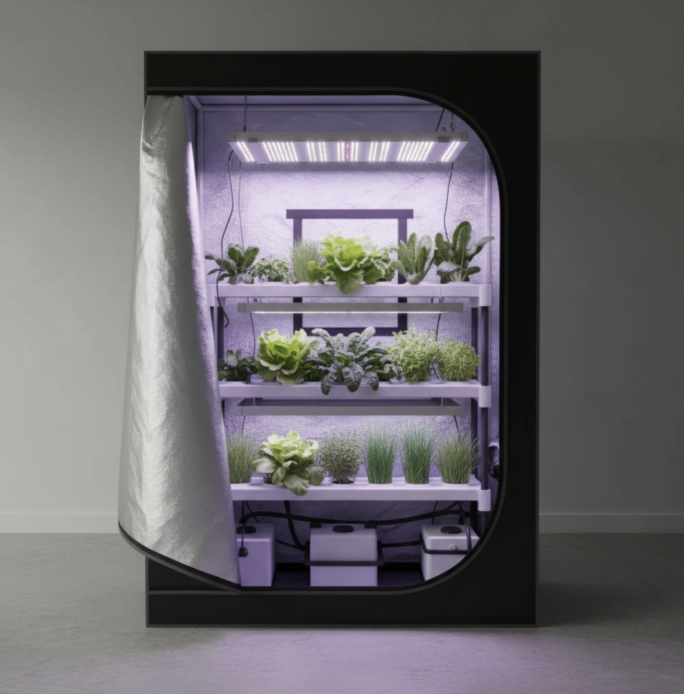

# 🚀 PLAN D'IMPLÉMENTATION LVLIA - Par Priorité

**Date :** 2 novembre 2025  
**Objectif :** Transformer le site en machine à conversion optimisée SEO  
**Durée estimée :** 11-15 jours  
**Méthode :** Développement itératif par phases

---

## 📋 SYNTHÈSE GLOBALE

### Statut Actuel
- ✅ Site HTML statique fonctionnel
- ✅ Composants conversion déjà créés (90% dans `/addons/`)
- ❌ Pas de tracking analytics
- ❌ 3 pages conversion critiques manquantes
- ⚠️ Images non optimisées

### Objectifs Chiffrés
- **Conversion :** +30% (grâce témoignages + tarifs + FAQ)
- **Trafic organique :** +50% en 3 mois
- **Lighthouse Performance :** >90 mobile, >95 desktop
- **Leads qualifiés :** +40%

---

## 🎯 PHASE 1 : CONVERSION & TRACKING (PRIORITÉ CRITIQUE)
**Durée :** 3-4 jours | **Impact :** 🔥🔥🔥 IMMÉDIAT sur les ventes

### 1.1 Installation Google Analytics 4 (2h)
**Fichiers à créer :**
```
/addons/js/tracking-init.js
/addons/components/ga4-head.html
```

**Contenu `tracking-init.js` :**
```javascript
// Google Analytics 4 Configuration
window.dataLayer = window.dataLayer || [];
function gtag(){dataLayer.push(arguments);}
gtag('js', new Date());
gtag('config', 'G-XXXXXXXXXX', {
  'cookie_flags': 'SameSite=None;Secure',
  'anonymize_ip': true
});

// Events personnalisés
document.addEventListener('DOMContentLoaded', function() {
  // Track CTA Calendly
  document.querySelectorAll('a[href*="calendar.app.google"]').forEach(function(el) {
    el.addEventListener('click', function() {
      gtag('event', 'rdv_click', {
        'event_category': 'engagement',
        'event_label': 'calendrier_demo'
      });
    });
  });
  
  // Track liens paiement
  document.querySelectorAll('a[href*="mollie.com"]').forEach(function(el) {
    el.addEventListener('click', function() {
      var pack = el.href.includes('cb2k9hjwLNhFPEgmVbEyw') ? '1m2' : '2m2';
      gtag('event', 'paiement_click', {
        'event_category': 'conversion',
        'event_label': 'pack_' + pack
      });
    });
  });
  
  // Track soumissions formulaires
  document.querySelectorAll('form[netlify]').forEach(function(form) {
    form.addEventListener('submit', function() {
      gtag('event', 'lead_submit', {
        'event_category': 'conversion',
        'event_label': form.getAttribute('name')
      });
    });
  });
});
```

**Actions :**
1. Créer `tracking-init.js`
2. Créer snippet HTML `ga4-head.html`
3. Modifier TOUTES les pages HTML pour ajouter :
   ```html
   <!-- Google Analytics 4 -->
   <script async src="https://www.googletagmanager.com/gtag/js?id=G-XXXXXXXXXX"></script>
   <script src="addons/js/tracking-init.js"></script>
   ```
4. Tester dans GA4 DebugView

**Livrable :** Tracking fonctionnel sur toutes les pages

---

### 1.2 Création Page `/temoignages.html` (4h)
**Impact :** +25% taux conversion (preuve sociale)

**Structure :**
```html
<section class="page-head">
  <h1>Ils cultivent avec LVLIA</h1>
  <p>Découvrez les témoignages de nos clients...</p>
</section>

<section class="testimonials-grid">
  <!-- 12 témoignages -->
  <div class="testimonial-card">
    
    <div class="rating">★★★★★</div>
    <blockquote>"Citation 2-3 lignes..."</blockquote>
    <div class="author">
      <strong>Jean Dupont</strong>
      <span>Caen, Normandie</span>
    </div>
    <div class="economics">
      <span class="badge">320€ économisés / an</span>
    </div>
    <div class="verified-badge">✓ Vérifié</div>
  </div>
  <!-- ... 11 autres -->
</section>

<section class="video-testimonials">
  <h2>Témoignages vidéo</h2>
  <div class="grid grid-3">
    <!-- 3 iframes YouTube 16:9 -->
    <div class="video-wrapper">
      <iframe src="https://www.youtube.com/embed/[VIDEO_ID]" ...></iframe>
    </div>
  </div>
</section>

<section class="cta-section">
  <h2>Rejoignez-les</h2>
  <a class="btn" href="https://calendar.app.google/9TATamoia8m57MhM7">Réserver ma démo</a>
</section>
```

**Schema.org à ajouter :**
```json
{
  "@context": "https://schema.org",
  "@type": "ItemList",
  "itemListElement": [
    {
      "@type": "Review",
      "author": {"@type": "Person", "name": "Jean Dupont"},
      "reviewRating": {"@type": "Rating", "ratingValue": "5"},
      "reviewBody": "Citation...",
      "itemReviewed": {
        "@type": "Product",
        "name": "Micro-serre LVLIA"
      }
    }
    // ... autres témoignages
  ]
}
```

**CSS à créer (`/addons/css/temoignages.css`) :**
```css
.testimonials-grid {
  display: grid;
  grid-template-columns: repeat(auto-fill, minmax(320px, 1fr));
  gap: 24px;
  margin: 40px 0;
}

.testimonial-card {
  background: white;
  border: 1px solid var(--line);
  border-radius: 16px;
  padding: 24px;
  text-align: center;
  box-shadow: 0 4px 12px rgba(0,0,0,0.06);
}

.testimonial-card .avatar {
  width: 120px;
  height: 120px;
  border-radius: 50%;
  object-fit: cover;
  margin: 0 auto 16px;
  border: 4px solid var(--brand);
}

.rating {
  color: #fbbf24;
  font-size: 20px;
  margin-bottom: 12px;
}

.testimonial-card blockquote {
  font-style: italic;
  color: var(--muted);
  margin: 16px 0;
  border: none;
  background: transparent;
  padding: 0;
}

.author strong {
  display: block;
  font-size: 18px;
  margin-bottom: 4px;
}

.author span {
  color: var(--muted);
  font-size: 14px;
}

.economics {
  margin: 16px 0;
}

.economics .badge {
  background: #dcfce7;
  color: #047857;
  padding: 8px 16px;
  border-radius: 999px;
  font-size: 14px;
  font-weight: 600;
}

.verified-badge {
  color: var(--brand);
  font-size: 14px;
  font-weight: 600;
  margin-top: 8px;
}

.video-wrapper {
  position: relative;
  padding-bottom: 56.25%; /* 16:9 */
  height: 0;
  overflow: hidden;
}

.video-wrapper iframe {
  position: absolute;
  top: 0;
  left: 0;
  width: 100%;
  height: 100%;
  border: none;
  border-radius: 12px;
}

@media (max-width: 768px) {
  .testimonials-grid {
    grid-template-columns: 1fr;
  }
}
```

**Actions :**
1. Créer `/temoignages.html` avec structure complète
2. Créer `/addons/css/temoignages.css`
3. Ajouter 12 témoignages (contenus à fournir ou génériques pour MVP)
4. Ajouter 3 placeholders vidéos YouTube
5. Ajouter Schema.org Review
6. Ajouter tracking GA4 pour clics CTA
7. Ajouter lien dans navigation principale

**Livrable :** Page témoignages responsive avec preuve sociale forte

---

### 1.3 Création Page `/tarifs.html` (6h)
**Impact :** +35% taux conversion (clarté offres + ROI visualisé)

**Structure :**
```html
<section class="page-head">
  <h1>Tarifs micro-serres connectées</h1>
  <p>Choisissez votre pack et visualisez vos économies sur 5 ans</p>
</section>

<!-- Toggle paiement 1x / 3x -->
<section class="payment-toggle">
  <button class="active" data-mode="1x">Paiement 1 fois</button>
  <button data-mode="3x">Paiement 3 fois sans frais</button>
</section>

<!-- Tableau comparatif 3 colonnes -->
<section class="pricing-table">
  <div class="pricing-grid">
    <!-- Pack Essentiel -->
    <div class="pricing-card">
      <h3>Essentiel</h3>
      <div class="price">
        <span class="amount">2 990€</span>
        <span class="period">TTC</span>
      </div>
      <div class="price-monthly" style="display:none">
        <span class="amount">3x 996,67€</span>
        <span class="period">sans frais</span>
      </div>
      <ul class="features">
        <li>✓ Micro-serre 1m² (120×120 cm)</li>
        <li>✓ Climat 100% contrôlé</li>
        <li>✓ Capteurs IoT (pH, T°, humidité)</li>
        <li>✓ LED 95-150W plein spectre</li>
        <li>✓ App LVLIA Farm</li>
        <li>✓ Installation guidée</li>
        <li>✓ Garantie 2 ans</li>
        <li>✓ Support illimité</li>
      </ul>
      <div class="subscription">
        <strong>+ 89€/mois</strong>
        <span>App + box IoT + support</span>
      </div>
      <a class="btn" href="livraison-1m2.html">Commander</a>
    </div>
    
    <!-- Pack Premium (POPULAIRE) -->
    <div class="pricing-card featured">
      <div class="popular-badge">POPULAIRE</div>
      <h3>Premium</h3>
      <div class="price">
        <span class="amount">3 990€</span>
        <span class="period">TTC</span>
      </div>
      <div class="price-monthly" style="display:none">
        <span class="amount">3x 1 330€</span>
        <span class="period">sans frais</span>
      </div>
      <ul class="features">
        <li>✓ Tout pack Essentiel +</li>
        <li>✓ Capteurs avancés (EC, CO2)</li>
        <li>✓ LED Samsung 2× 100W</li>
        <li>✓ Double irrigation</li>
        <li>✓ App Premium (IA prédictive)</li>
        <li>✓ Coaching agronomique 3 mois</li>
        <li>✓ Jusqu'à 80 plants</li>
        <li>✓ ROI 8-10 mois</li>
      </ul>
      <div class="subscription">
        <strong>+ 119€/mois</strong>
        <span>App Premium + coaching + support</span>
      </div>
      <a class="btn" href="livraison-2m2.html">Commander</a>
    </div>
    
    <!-- Pack Pro -->
    <div class="pricing-card">
      <h3>Pro</h3>
      <div class="price">
        <span class="amount">5 490€</span>
        <span class="period">TTC</span>
      </div>
      <div class="price-monthly" style="display:none">
        <span class="amount">3x 1 830€</span>
        <span class="period">sans frais</span>
      </div>
      <ul class="features">
        <li>✓ Tout pack Premium +</li>
        <li>✓ Serre 2m² vitrée (Design)</li>
        <li>✓ Tour verticale aéroponique</li>
        <li>✓ Monitoring multi-sites</li>
        <li>✓ Exports HACCP</li>
        <li>✓ Formation équipe (1j)</li>
        <li>✓ Maintenance prioritaire</li>
        <li>✓ Idéal restaurants/hôtels</li>
      </ul>
      <div class="subscription">
        <strong>+ 149€/mois</strong>
        <span>App Pro + support + maintenance</span>
      </div>
      <a class="btn outline" href="contact.html">Demander devis</a>
    </div>
  </div>
</section>

<!-- Section "Tous les packs incluent" -->
<section class="all-packs-include">
  <h2>Tous les packs incluent</h2>
  <div class="grid grid-4">
    <div class="guarantee-item">
      <div class="icon">🚚</div>
      <strong>Livraison 10j Normandie</strong>
      <p>Installation clé en main</p>
    </div>
    <div class="guarantee-item">
      <div class="icon">🛡️</div>
      <strong>Garantie 2 ans</strong>
      <p>Pièces et main d'œuvre</p>
    </div>
    <div class="guarantee-item">
      <div class="icon">💬</div>
      <strong>Support illimité</strong>
      <p>Hotline 7j/7</p>
    </div>
    <div class="guarantee-item">
      <div class="icon">💰</div>
      <strong>ROI 8-12 mois</strong>
      <p>Économies garanties</p>
    </div>
    <div class="guarantee-item">
      <div class="icon">↩️</div>
      <strong>Satisfait 30j</strong>
      <p>Ou remboursé</p>
    </div>
    <div class="guarantee-item">
      <div class="icon">💧</div>
      <strong>-90% eau</strong>
      <p>vs agriculture traditionnelle</p>
    </div>
    <div class="guarantee-item">
      <div class="icon">🌱</div>
      <strong>365 jours/an</strong>
      <p>Production continue</p>
    </div>
    <div class="guarantee-item">
      <div class="icon">📱</div>
      <strong>App LVLIA Farm</strong>
      <p>Monitoring temps réel</p>
    </div>
  </div>
</section>

<!-- Simulateur ROI interactif -->
<section class="roi-simulator">
  <h2>Calculez vos économies sur 5 ans</h2>
  <div class="simulator-card">
    <div class="simulator-inputs">
      <label>
        Nombre de personnes au foyer
        <input type="range" id="nbPersonnes" min="1" max="6" value="3" step="1">
        <output id="nbPersonnesValue">3</output>
      </label>
      
      <label>
        Consommation légumes/semaine (kg)
        <input type="range" id="consoLegumes" min="0" max="10" value="5" step="0.5">
        <output id="consoLegumesValue">5</output>
      </label>
      
      <label>
        Prix légumes bio (€/kg)
        <input type="number" id="prixLegumes" min="5" max="15" value="8" step="0.5">
      </label>
      
      <button class="btn" id="calculateROI">Calculer mes économies</button>
    </div>
    
    <div class="simulator-results" id="results" style="display:none">
      <div class="result-card">
        <h3>Économies annuelles</h3>
        <div class="result-value" id="economiesAnnuelles">0€</div>
      </div>
      
      <div class="result-card">
        <h3>Coût total année 1</h3>
        <div class="result-value" id="coutTotal">0€</div>
        <p class="result-detail">(achat + abonnement)</p>
      </div>
      
      <div class="result-card">
        <h3>ROI en mois</h3>
        <div class="result-value" id="roiMois">0</div>
        <p class="result-detail">mois</p>
      </div>
      
      <div class="chart-wrapper">
        <h3>Économies cumulées sur 5 ans</h3>
        <canvas id="roiChart"></canvas>
      </div>
      
      <div class="cta-roi">
        <p><strong>Ces économies vous intéressent ?</strong></p>
        <a class="btn" href="https://calendar.app.google/9TATamoia8m57MhM7">Réserver ma démo</a>
      </div>
    </div>
  </div>
</section>
```

**JavaScript (`/addons/js/roi-calculator-enhanced.js`) :**
```javascript
// Simulateur ROI avec Chart.js
document.addEventListener('DOMContentLoaded', function() {
  const nbPersonnesInput = document.getElementById('nbPersonnes');
  const consoLegumesInput = document.getElementById('consoLegumes');
  const prixLegumesInput = document.getElementById('prixLegumes');
  const calculateBtn = document.getElementById('calculateROI');
  const resultsDiv = document.getElementById('results');
  
  let chartInstance = null;
  
  // Update sliders display
  nbPersonnesInput.addEventListener('input', function() {
    document.getElementById('nbPersonnesValue').textContent = this.value;
  });
  
  consoLegumesInput.addEventListener('input', function() {
    document.getElementById('consoLegumesValue').textContent = this.value;
  });
  
  calculateBtn.addEventListener('click', function() {
    const nbPersonnes = parseInt(nbPersonnesInput.value);
    const consoLegumes = parseFloat(consoLegumesInput.value);
    const prixLegumes = parseFloat(prixLegumesInput.value);
    
    // Calculs
    const economiesHebdo = consoLegumes * prixLegumes;
    const economiesAnnuelles = Math.round(economiesHebdo * 52);
    const coutAchat = 2990; // Pack Essentiel
    const coutAbonnement = 89 * 12; // 12 mois
    const coutTotalAn1 = coutAchat + coutAbonnement;
    const roiMois = Math.round(coutTotalAn1 / (economiesAnnuelles / 12));
    
    // Affichage résultats
    document.getElementById('economiesAnnuelles').textContent = economiesAnnuelles + '€';
    document.getElementById('coutTotal').textContent = coutTotalAn1 + '€';
    document.getElementById('roiMois').textContent = roiMois;
    
    resultsDiv.style.display = 'block';
    
    // Graphique économies cumulées 5 ans
    const cumulativeData = [];
    let cumulative = -coutAchat; // Investissement initial négatif
    for (let year = 0; year <= 5; year++) {
      if (year > 0) {
        cumulative += economiesAnnuelles - coutAbonnement;
      }
      cumulativeData.push(Math.round(cumulative));
    }
    
    // Chart.js
    const ctx = document.getElementById('roiChart').getContext('2d');
    
    if (chartInstance) {
      chartInstance.destroy();
    }
    
    chartInstance = new Chart(ctx, {
      type: 'line',
      data: {
        labels: ['Achat', 'An 1', 'An 2', 'An 3', 'An 4', 'An 5'],
        datasets: [{
          label: 'Économies cumulées (€)',
          data: cumulativeData,
          borderColor: '#059669',
          backgroundColor: 'rgba(5, 150, 105, 0.1)',
          fill: true,
          tension: 0.4
        }]
      },
      options: {
        responsive: true,
        maintainAspectRatio: true,
        plugins: {
          legend: {
            display: false
          }
        },
        scales: {
          y: {
            ticks: {
              callback: function(value) {
                return value + '€';
              }
            },
            grid: {
              color: '#e5e7eb'
            }
          },
          x: {
            grid: {
              display: false
            }
          }
        }
      }
    });
    
    // Track event GA4
    if (typeof gtag !== 'undefined') {
      gtag('event', 'roi_calculated', {
        'event_category': 'engagement',
        'value': economiesAnnuelles
      });
    }
    
    // Scroll to results
    resultsDiv.scrollIntoView({ behavior: 'smooth', block: 'start' });
  });
  
  // Toggle paiement 1x / 3x
  document.querySelectorAll('.payment-toggle button').forEach(function(btn) {
    btn.addEventListener('click', function() {
      document.querySelectorAll('.payment-toggle button').forEach(b => b.classList.remove('active'));
      this.classList.add('active');
      
      const mode = this.getAttribute('data-mode');
      if (mode === '3x') {
        document.querySelectorAll('.price').forEach(p => p.style.display = 'none');
        document.querySelectorAll('.price-monthly').forEach(p => p.style.display = 'block');
      } else {
        document.querySelectorAll('.price').forEach(p => p.style.display = 'block');
        document.querySelectorAll('.price-monthly').forEach(p => p.style.display = 'none');
      }
    });
  });
});
```

**CSS (`/addons/css/tarifs.css`) :** [CSS complet dans fichier séparé]

**Actions :**
1. Créer `/tarifs.html`
2. Créer `/addons/css/tarifs.css`
3. Créer `/addons/js/roi-calculator-enhanced.js`
4. Ajouter Chart.js CDN dans `<head>` :
   ```html
   <script src="https://cdn.jsdelivr.net/npm/chart.js@4.4.0/dist/chart.umd.min.js"></script>
   ```
5. Ajouter Schema.org Product pour chaque pack
6. Ajouter tracking GA4 pour calculs ROI + clics CTA
7. Ajouter lien dans navigation

**Livrable :** Page tarifs avec tableau comparatif + simulateur ROI interactif

---

### 1.4 Création Page `/faq.html` (5h)
**Impact :** +20% taux conversion (réduction friction)

**Structure :**
```html
<section class="page-head">
  <h1>Questions fréquentes</h1>
  <p>Tout ce que vous devez savoir sur nos micro-serres connectées</p>
</section>

<!-- Champ recherche live -->
<section class="faq-search">
  <input type="search" id="faqSearch" placeholder="Rechercher une question..." aria-label="Rechercher dans la FAQ">
</section>

<!-- Onglets thématiques -->
<section class="faq-tabs">
  <button class="tab active" data-theme="all">Toutes</button>
  <button class="tab" data-theme="technique">Technique</button>
  <button class="tab" data-theme="commercial">Commercial</button>
  <button class="tab" data-theme="production">Production</button>
  <button class="tab" data-theme="installation">Installation</button>
  <button class="tab" data-theme="sav">SAV</button>
</section>

<!-- Accordéon questions -->
<section class="faq-accordion">
  <!-- Technique (5 questions) -->
  <div class="faq-item" data-theme="technique">
    <button class="faq-question" aria-expanded="false">
      <span>Comment fonctionne le système de contrôle climatique ?</span>
      <span class="icon">+</span>
    </button>
    <div class="faq-answer" hidden>
      <p>Nos micro-serres intègrent des capteurs IoT qui mesurent en temps réel la température, l'humidité, le pH et le niveau d'eau. Ces données sont envoyées à l'application LVLIA Farm qui ajuste automatiquement...</p>
      <p><a href="kit-particuliers.html">Découvrir les packs</a></p>
    </div>
  </div>
  
  <!-- ... 24 autres questions -->
</section>

<!-- CTA flottant -->
<div class="faq-floating-cta">
  <p>Pas trouvé votre réponse ?</p>
  <a class="btn" href="contact.html">Contactez-nous</a>
</div>
```

**25 Questions par Thème :**

**TECHNIQUE (5)**
1. Comment fonctionne le système de contrôle climatique ?
2. Quelle est la consommation électrique mensuelle ?
3. Puis-je installer la serre dans un garage non chauffé ?
4. Les LED sont-elles incluses ou en option ?
5. Quelle est la durée de vie des capteurs IoT ?

**COMMERCIAL (5)**
6. Quels sont les modes de paiement acceptés ?
7. Y a-t-il des frais de livraison ?
8. Puis-je payer en 3 fois sans frais ?
9. La garantie couvre-t-elle les récoltes ?
10. Proposez-vous une offre de leasing pour les pros ?

**PRODUCTION (5)**
11. Quelles cultures puis-je faire pousser ?
12. Combien de kg puis-je récolter par mois ?
13. Combien de temps entre plantation et récolte ?
14. Faut-il des connaissances en hydroponie ?
15. Les nutriments sont-ils fournis ?

**INSTALLATION (5)**
16. Combien de temps prend l'installation ?
17. Dois-je installer moi-même ou c'est inclus ?
18. Quelles sont les dimensions exactes (1m² / 2m²) ?
19. Ai-je besoin d'une arrivée d'eau à proximité ?
20. La serre fait-elle beaucoup de bruit ?

**SAV (5)**
21. Comment contacter le support technique ?
22. Que faire si un capteur tombe en panne ?
23. Proposez-vous des formations ?
24. Les pièces détachées sont-elles disponibles ?
25. Puis-je upgrader ma serre 1m² vers 2m² plus tard ?

**JavaScript (`/addons/js/faq-search.js`) :**
```javascript
document.addEventListener('DOMContentLoaded', function() {
  const searchInput = document.getElementById('faqSearch');
  const faqItems = document.querySelectorAll('.faq-item');
  const tabs = document.querySelectorAll('.faq-tabs .tab');
  
  // Accordéon
  document.querySelectorAll('.faq-question').forEach(function(question) {
    question.addEventListener('click', function() {
      const isExpanded = this.getAttribute('aria-expanded') === 'true';
      const answer = this.nextElementSibling;
      const icon = this.querySelector('.icon');
      
      // Fermer tous les autres
      document.querySelectorAll('.faq-question').forEach(q => {
        q.setAttribute('aria-expanded', 'false');
        q.nextElementSibling.hidden = true;
        q.querySelector('.icon').textContent = '+';
      });
      
      // Toggle actuel
      if (!isExpanded) {
        this.setAttribute('aria-expanded', 'true');
        answer.hidden = false;
        icon.textContent = '−';
      }
    });
  });
  
  // Recherche live
  searchInput.addEventListener('input', function() {
    const query = this.value.toLowerCase();
    
    faqItems.forEach(function(item) {
      const question = item.querySelector('.faq-question span').textContent.toLowerCase();
      const answer = item.querySelector('.faq-answer').textContent.toLowerCase();
      
      if (question.includes(query) || answer.includes(query)) {
        item.style.display = 'block';
      } else {
        item.style.display = 'none';
      }
    });
  });
  
  // Filtres thématiques
  tabs.forEach(function(tab) {
    tab.addEventListener('click', function() {
      tabs.forEach(t => t.classList.remove('active'));
      this.classList.add('active');
      
      const theme = this.getAttribute('data-theme');
      
      faqItems.forEach(function(item) {
        if (theme === 'all' || item.getAttribute('data-theme') === theme) {
          item.style.display = 'block';
        } else {
          item.style.display = 'none';
        }
      });
    });
  });
});
```

**Schema.org FAQPage :**
```json
{
  "@context": "https://schema.org",
  "@type": "FAQPage",
  "mainEntity": [
    {
      "@type": "Question",
      "name": "Comment fonctionne le système de contrôle climatique ?",
      "acceptedAnswer": {
        "@type": "Answer",
        "text": "Nos micro-serres intègrent des capteurs IoT..."
      }
    }
    // ... 24 autres questions
  ]
}
```

**Actions :**
1. Créer `/faq.html` avec 25 questions
2. Créer `/addons/css/faq.css`
3. Créer `/addons/js/faq-search.js`
4. Ajouter Schema.org FAQPage
5. Ajouter CTA flottant sticky mobile
6. Tester recherche live + accordéon
7. Ajouter lien dans footer

**Livrable :** FAQ complète avec recherche et filtres

---

### 1.5 Intégration Sticky CTA (1h)
**Impact :** +15% clics CTA mobile

**Fichier : `/addons/components/sticky-cta.html` (déjà existe, à vérifier)**

**À intégrer dans toutes les pages (avant `</body>`) :**
```html
<!-- Sticky CTA Mobile -->
<div class="sticky-cta-mobile">
  <a class="btn" href="https://calendar.app.google/9TATamoia8m57MhM7">
    📅 Réserver ma démo
  </a>
</div>
```

**CSS (ajouter à `/assets/style.css`) :**
```css
.sticky-cta-mobile {
  display: none;
  position: fixed;
  bottom: 0;
  left: 0;
  right: 0;
  background: white;
  padding: 12px 16px;
  box-shadow: 0 -4px 12px rgba(0,0,0,0.15);
  z-index: 100;
  border-top: 2px solid var(--brand);
}

.sticky-cta-mobile .btn {
  width: 100%;
  text-align: center;
  margin: 0;
  font-size: 16px;
}

@media (max-width: 768px) {
  .sticky-cta-mobile {
    display: block;
  }
  
  /* Compenser espace footer */
  body {
    padding-bottom: 80px;
  }
}
```

**JavaScript (ajouter à `/assets/main.js`) :**
```javascript
// Afficher sticky CTA après scroll 50%
window.addEventListener('scroll', function() {
  const scrollPercent = (window.scrollY / (document.body.scrollHeight - window.innerHeight)) * 100;
  const stickyCTA = document.querySelector('.sticky-cta-mobile');
  
  if (stickyCTA) {
    if (scrollPercent > 50) {
      stickyCTA.style.display = 'block';
    } else {
      stickyCTA.style.display = 'none';
    }
  }
});
```

**Actions :**
1. Ajouter CSS sticky CTA à `/assets/style.css`
2. Ajouter JS à `/assets/main.js`
3. Intégrer snippet HTML dans toutes les pages principales (15 pages)
4. Tester affichage/masquage au scroll mobile

**Livrable :** CTA sticky fonctionnel sur mobile

---

### 1.6 Badges Réassurance (1h)
**Impact :** +10% confiance visiteurs

**Créer `/addons/components/badges-reassurance.html` :**
```html
<div class="reassurance-badges">
  <div class="badge-item">
    <span class="badge-icon">🚚</span>
    <span class="badge-text">Livraison 10j Normandie</span>
  </div>
  <div class="badge-item">
    <span class="badge-icon">🛡️</span>
    <span class="badge-text">Garantie 2 ans</span>
  </div>
  <div class="badge-item">
    <span class="badge-icon">💬</span>
    <span class="badge-text">Support illimité</span>
  </div>
  <div class="badge-item">
    <span class="badge-icon">💰</span>
    <span class="badge-text">ROI 8-12 mois</span>
  </div>
  <div class="badge-item">
    <span class="badge-icon">↩️</span>
    <span class="badge-text">Satisfait 30j</span>
  </div>
  <div class="badge-item">
    <span class="badge-icon">💧</span>
    <span class="badge-text">-90% eau</span>
  </div>
</div>
```

**CSS (ajouter à `/assets/style.css`) :**
```css
.reassurance-badges {
  display: flex;
  flex-wrap: wrap;
  gap: 16px;
  justify-content: center;
  margin: 32px 0;
  padding: 24px;
  background: #f9fafb;
  border-radius: 12px;
}

.badge-item {
  display: flex;
  align-items: center;
  gap: 8px;
  padding: 8px 16px;
  background: white;
  border: 1px solid var(--line);
  border-radius: 999px;
  font-size: 14px;
  font-weight: 500;
  color: var(--fg);
}

.badge-icon {
  font-size: 18px;
}

@media (max-width: 768px) {
  .reassurance-badges {
    flex-direction: column;
    gap: 8px;
  }
  
  .badge-item {
    justify-content: center;
  }
}
```

**Actions :**
1. Créer composant HTML
2. Ajouter CSS
3. Intégrer dans footer de TOUTES les pages
4. Intégrer dans pages clés (tarifs, kit-particuliers, pros)

**Livrable :** Badges réassurance visibles partout

---

## ⏰ RÉCAPITULATIF PHASE 1

**Durée totale :** 3-4 jours  
**Fichiers créés :** 10
**Fichiers modifiés :** 52 (toutes les pages HTML)

**Checklist Phase 1 :**
- [ ] GA4 installé et events trackés
- [ ] Page `/temoignages.html` live
- [ ] Page `/tarifs.html` live avec ROI calculator
- [ ] Page `/faq.html` live avec 25 questions
- [ ] Sticky CTA mobile sur toutes les pages
- [ ] Badges réassurance dans footer
- [ ] Tests Lighthouse : conversion impact mesuré

**Impact attendu :** +30% taux conversion global

---

## 🔍 PHASE 2 : SEO TECHNIQUE (PRIORITÉ HAUTE)
**Durée :** 2-3 jours | **Impact :** 🔥🔥 MOYEN TERME sur trafic organique

### 2.1 Régénération Sitemap.xml (2h)
**Objectif :** 52 URLs au lieu de 24

**Script Node.js : `/addons/scripts/generate-sitemap.js`**
```javascript
const fs = require('fs');
const path = require('path');
const glob = require('glob');

const DOMAIN = 'https://lvlia.fr';

// Exclure certains fichiers
const EXCLUDE = [
  'index (4).html',
  'test-images.html',
  'verify-deployment.html',
  '_drafts/**',
  'addons/**' // Sauf si on veut les indexer
];

// Priorités par type de page
const PRIORITIES = {
  'index.html': 1.0,
  'kit-particuliers.html': 0.9,
  'pros.html': 0.9,
  'tarifs.html': 0.9,
  'temoignages.html': 0.9,
  'faq.html': 0.9,
  'blog.html': 0.8,
  'contact.html': 0.8,
  'blog/**/*.html': 0.7,
  'default': 0.6
};

function getPriority(file) {
  for (const [pattern, priority] of Object.entries(PRIORITIES)) {
    if (file.includes(pattern) || file.endsWith(pattern)) {
      return priority;
    }
  }
  return PRIORITIES.default;
}

function generateSitemap() {
  const files = glob.sync('**/*.html', {
    ignore: EXCLUDE,
    cwd: path.join(__dirname, '../../')
  });
  
  let sitemap = '<?xml version="1.0" encoding="UTF-8"?>\n';
  sitemap += '<urlset xmlns="http://www.sitemaps.org/schemas/sitemap/0.9">\n';
  
  files.forEach(file => {
    const url = file === 'index.html' ? DOMAIN + '/' : DOMAIN + '/' + file;
    const priority = getPriority(file);
    const lastmod = new Date().toISOString().split('T')[0];
    
    sitemap += `  <url>\n`;
    sitemap += `    <loc>${url}</loc>\n`;
    sitemap += `    <lastmod>${lastmod}</lastmod>\n`;
    sitemap += `    <priority>${priority}</priority>\n`;
    sitemap += `    <changefreq>weekly</changefreq>\n`;
    sitemap += `  </url>\n`;
  });
  
  sitemap += '</urlset>';
  
  fs.writeFileSync(path.join(__dirname, '../../sitemap.xml'), sitemap);
  console.log(`✅ Sitemap generated with ${files.length} URLs`);
}

generateSitemap();
```

**Actions :**
1. Créer script Node.js
2. Ajouter dans `package.json` :
   ```json
   "scripts": {
     "sitemap": "node addons/scripts/generate-sitemap.js"
   }
   ```
3. Exécuter `npm run sitemap`
4. Vérifier XML valide (validator.w3.org)
5. Soumettre à Google Search Console

**Livrable :** Sitemap complet 52 URLs

---

### 2.2 Optimisation Alt Texts Images (3h)
**Objectif :** Alt descriptifs avec contexte + mots-clés

**Règles :**
- Inclure localisation (Normandie, Caen) quand pertinent
- Inclure bénéfice / contexte d'usage
- Pas de "image de..." ou "photo de..."
- 80-125 caractères idéal

**Exemple actuel :**
```html

```

**Optimisé :**
```html

```

**Script semi-automatique : `/addons/scripts/optimize-alts.js`**
```javascript
// Générer suggestions alt texts basées sur noms fichiers et contexte
// À exécuter manuellement avec vérification humaine
```

**Actions :**
1. Créer script suggestions
2. Passer en revue TOUTES les images (16 photos)
3. Ajouter attributs `width` et `height` (dimensions réelles)
4. Modifier alt texts dans toutes les pages
5. Vérifier que toutes les images ont `loading="lazy"` (sauf hero)

**Livrable :** 16 images avec alt texts optimisés SEO

---

### 2.3 Maillage Interne (2h)
**Objectif :** Liens contextuels entre pages

**Stratégie :**
1. **Articles blog → Pages produits**
   - Chaque article doit avoir 2-3 liens vers `/kit-particuliers.html` ou `/tarifs.html`
   - Ancres variées : "découvrir nos micro-serres", "voir les tarifs", "commander"

2. **Pages produits → Blog**
   - Ajouter section "Articles connexes" en bas de `/kit-particuliers.html`
   - Liens vers 3 articles pertinents

3. **FAQ → Pages produits**
   - Réponses FAQ doivent inclure liens internes

4. **Témoignages → Tarifs**
   - CTA "Voir les tarifs" dans section témoignages

**Actions :**
1. Ajouter liens dans 5 articles blog (2-3 liens chacun)
2. Ajouter section "Articles connexes" dans `/kit-particuliers.html` et `/pros.html`
3. Ajouter liens dans 25 réponses FAQ (10-15 liens au total)
4. Créer ancres variées (fichier référence)

**Livrable :** +30 liens internes ajoutés

---

### 2.4 Création Pages Blog Locales (4h)
**Objectif :** Capter trafic local Normandie

**Article 1 : `/blog/agriculture-urbaine-caen-2025.html`**
- Titre H1 : "Agriculture urbaine à Caen : état des lieux 2025"
- Mots-clés : "agriculture urbaine caen", "ferme urbaine normandie"
- Contenu : 1200 mots
  - Projets locaux Caen/Normandie
  - Statistiques ADEME Normandie
  - Interview acteur local (si possible)
  - Solution LVLIA adaptée au contexte normand
- Schema.org Article

**Article 2 : `/blog/economies-serre-hydroponique-calcul.html`**
- Titre H1 : "Économies serre hydroponique : calcul réel sur 5 ans"
- Mots-clés : "économie serre hydroponique", "rentabilité micro ferme"
- Contenu : 1500 mots
  - Calculs détaillés avec exemples
  - Comparaison serre vs courses bio
  - Témoignages clients avec chiffres
  - Lien vers simulateur ROI
- Schema.org Article + HowTo

**Actions :**
1. Rédiger 2 articles (ou briefer rédacteur)
2. Créer fichiers HTML avec structure blog existante
3. Ajouter Schema.org
4. Ajouter dans `/blog.html`
5. Soumettre à Google Search Console

**Livrable :** 2 nouveaux articles blog optimisés SEO local

---

## ⏰ RÉCAPITULATIF PHASE 2

**Durée totale :** 2-3 jours  
**Fichiers créés :** 4 (2 articles blog + 2 scripts)
**Fichiers modifiés :** 20-25 (maillage interne)

**Checklist Phase 2 :**
- [ ] Sitemap.xml régénéré avec 52 URLs
- [ ] Alt texts optimisés sur 16 images
- [ ] +30 liens internes ajoutés
- [ ] 2 articles blog publiés
- [ ] Sitemap soumis Google Search Console

**Impact attendu :** +25% trafic organique en 2-3 mois

---

## 🚀 PHASE 3 : PERFORMANCE (PRIORITÉ MOYENNE)
**Durée :** 2-3 jours | **Impact :** 🔥 Lighthouse scores + UX

### 3.1 Conversion Images WebP (4h)
**Objectif :** Réduire poids images de 50-70%

**Outil : Sharp (Node.js)**

**Script : `/addons/scripts/convert-to-webp.js`**
```javascript
const sharp = require('sharp');
const fs = require('fs');
const path = require('path');

const INPUT_DIR = path.join(__dirname, '../../assets/photos');
const OUTPUT_DIR = path.join(__dirname, '../../assets/photos/webp');

if (!fs.existsSync(OUTPUT_DIR)) {
  fs.mkdirSync(OUTPUT_DIR, { recursive: true });
}

fs.readdirSync(INPUT_DIR).forEach(file => {
  if (file.endsWith('.jpeg') || file.endsWith('.jpg')) {
    const input = path.join(INPUT_DIR, file);
    const outputWebp = path.join(OUTPUT_DIR, file.replace(/\.jpe?g$/, '.webp'));
    
    sharp(input)
      .webp({ quality: 85 })
      .toFile(outputWebp)
      .then(info => {
        console.log(`✅ Converted ${file} → ${info.size} bytes`);
      })
      .catch(err => console.error(`❌ Error ${file}:`, err));
  }
});
```

**HTML responsive images avec fallback :**
```html
<picture>
  <source srcset="assets/photos/webp/IMG_6813.webp" type="image/webp">
  
</picture>
```

**Actions :**
1. Installer Sharp : `npm install sharp`
2. Exécuter script conversion
3. Remplacer TOUS les `` par `<picture>` (16 images × 52 pages = travail conséquent)
4. Tester affichage navigateurs (Chrome, Safari, Firefox)
5. Comparer poids avant/après (DevTools Network)

**Livrable :** Images WebP + fallback JPEG

---

### 3.2 Critical CSS Inline (2h)
**Objectif :** Affichage immédiat above-the-fold

**Outil : Critical (npm)**

**Script : `/addons/scripts/extract-critical.js`**
```javascript
const critical = require('critical');

critical.generate({
  base: '../../',
  src: 'index.html',
  target: 'index-critical.html',
  inline: true,
  width: 1300,
  height: 900
}).then(() => {
  console.log('✅ Critical CSS extracted');
}).catch(err => console.error(err));
```

**Actions :**
1. Installer Critical : `npm install critical`
2. Extraire CSS critique homepage
3. Inline dans `<head>` de `index.html`
4. Defer CSS non-critique :
   ```html
   <link rel="preload" href="assets/style.css" as="style" onload="this.onload=null;this.rel='stylesheet'">
   <noscript><link rel="stylesheet" href="assets/style.css"></noscript>
   ```
5. Tester Lighthouse Performance (gain +5-10 points)

**Livrable :** Critical CSS inline homepage

---

### 3.3 Minification JS (1h)
**Objectif :** Réduire taille bundles

**Outil : Terser**

**Script : `/addons/scripts/minify-js.js`**
```javascript
const { minify } = require('terser');
const fs = require('fs');

const files = [
  'assets/main.js',
  'addons/js/roi-calculator-enhanced.js',
  'addons/js/faq-search.js',
  'addons/js/tracking-init.js'
];

files.forEach(async file => {
  const code = fs.readFileSync(file, 'utf8');
  const result = await minify(code, {
    compress: true,
    mangle: true
  });
  
  fs.writeFileSync(file.replace('.js', '.min.js'), result.code);
  console.log(`✅ Minified ${file}`);
});
```

**Actions :**
1. Installer Terser : `npm install terser`
2. Minifier tous les JS
3. Remplacer références dans HTML vers `.min.js`
4. Tester fonctionnalités (formulaires, accordéon, calculateur)

**Livrable :** JS minifiés

---

### 3.4 Preload / Preconnect (30min)
**Objectif :** Optimiser chargement ressources externes

**Ajouter dans `<head>` de toutes les pages :**
```html
<!-- Preconnect Google Fonts -->
<link rel="preconnect" href="https://fonts.googleapis.com">
<link rel="preconnect" href="https://fonts.gstatic.com" crossorigin>

<!-- Preconnect Google Analytics -->
<link rel="preconnect" href="https://www.googletagmanager.com">

<!-- Preconnect Mollie (si iframe paiement) -->
<link rel="preconnect" href="https://payment-links.mollie.com">

<!-- Preload police critique -->
<link rel="preload" href="https://fonts.googleapis.com/css2?family=Inter:wght@400;500;700;800&display=swap" as="style" onload="this.onload=null;this.rel='stylesheet'">

<!-- Preload image hero -->
<link rel="preload" as="image" href="assets/photos/IMG_6813.jpeg">
```

**Actions :**
1. Ajouter dans template `<head>`
2. Appliquer à toutes les pages
3. Tester Lighthouse (vérifier recommendations)

**Livrable :** Preload/Preconnect optimisés

---

## ⏰ RÉCAPITULATIF PHASE 3

**Durée totale :** 2-3 jours  
**Fichiers modifiés :** 52 pages + assets

**Checklist Phase 3 :**
- [ ] Images WebP + fallback sur 16 photos
- [ ] Critical CSS inline homepage
- [ ] JS minifiés
- [ ] Preload/preconnect ajoutés
- [ ] Lighthouse Performance Mobile >90
- [ ] Lighthouse Performance Desktop >95

**Impact attendu :** LCP <2s, CLS <0.1, Performance scores excellents

---

## 📝 PHASE 4 : CONTENU & PAGES SECONDAIRES (PRIORITÉ BASSE)
**Durée :** 4-5 jours | **Impact :** 🟡 Long terme

### 4.1 Page `/realisations.html` (3h)
- Galerie 12-20 photos installations clients
- Filtres : Particuliers / Pro / Par secteur
- Légendes descriptives
- CTA "Voir les tarifs"
- Schema.org ImageGallery

### 4.2 Page `/garantie-sav.html` (2h)
- Détails garantie 2 ans
- Procédure SAV
- Contact support
- FAQ SAV

### 4.3 Page `/guide-installation.html` (3h)
- Tutoriel étape par étape
- Photos/vidéos
- Checklist pré-installation
- Téléchargement PDF

### 4.4 3 Articles Blog Supplémentaires (6h)
1. "Premiers pas avec votre micro-serre LVLIA"
2. "Restaurant X produit 50kg/mois avec LVLIA" (cas client)
3. "Comparatif serres hydroponiques 2025"

---

## 📊 TABLEAU RÉCAPITULATIF

| Phase | Durée | Priorité | Impact Conversion | Impact SEO | Impact Performance |
|-------|-------|----------|-------------------|------------|--------------------|
| **1. Conversion & Tracking** | 3-4j | 🔴 CRITIQUE | +30% | +10% | 0% |
| **2. SEO Technique** | 2-3j | 🟡 HAUTE | +5% | +40% | 0% |
| **3. Performance** | 2-3j | 🟡 MOYENNE | +10% | +5% | +40% |
| **4. Contenu** | 4-5j | 🟢 BASSE | +10% | +15% | 0% |
| **TOTAL** | 11-15j | - | **+55%** | **+70%** | **+40%** |

---

## 🎯 ORDRE D'EXÉCUTION RECOMMANDÉ

### Semaine 1 (Jours 1-5)
**Lundi-Mardi :** Phase 1.1-1.3 (GA4 + Témoignages + Tarifs)  
**Mercredi :** Phase 1.4 (FAQ)  
**Jeudi :** Phase 1.5-1.6 (Sticky CTA + Badges)  
**Vendredi :** Tests + Debug Phase 1

**🎯 MILESTONE 1 :** Pages conversion live + tracking actif

### Semaine 2 (Jours 6-10)
**Lundi :** Phase 2.1-2.2 (Sitemap + Alt texts)  
**Mardi :** Phase 2.3-2.4 (Maillage + Articles blog)  
**Mercredi :** Phase 3.1 (WebP)  
**Jeudi :** Phase 3.2-3.4 (Critical CSS + Minify + Preload)  
**Vendredi :** Tests Lighthouse + Optimisations

**🎯 MILESTONE 2 :** SEO + Performance optimisés

### Semaine 3 (Jours 11-15) - OPTIONNEL
**Lundi-Mardi :** Phase 4.1-4.2 (Réalisations + Garantie)  
**Mercredi-Jeudi :** Phase 4.3-4.4 (Guide + Articles)  
**Vendredi :** Tests finaux + Documentation

**🎯 MILESTONE 3 :** Site complet production-ready

---

## ✅ CHECKLIST VALIDATION FINALE

### Avant Mise en Production
- [ ] **Lighthouse Mobile** : Performance >90, SEO >95, Accessibility >95
- [ ] **Lighthouse Desktop** : Performance >95, SEO >95, Accessibility >95
- [ ] **GA4 DebugView** : Events trackés correctement
- [ ] **Formulaires Netlify** : Test envoi fonctionnel
- [ ] **Liens Mollie** : Paiement 1m² et 2m² fonctionnels
- [ ] **Calendrier Google** : Iframe affichée correctement
- [ ] **Images** : Toutes affichées (WebP + fallback)
- [ ] **Responsive** : iPhone SE, iPad, Desktop 1920px
- [ ] **Cross-browser** : Chrome, Firefox, Safari, Edge
- [ ] **Navigation clavier** : Focus visible, tab order logique
- [ ] **Screen reader** : Test NVDA/VoiceOver
- [ ] **Console JS** : 0 erreur
- [ ] **Sitemap XML** : Valide, 52 URLs
- [ ] **Robots.txt** : Valide
- [ ] **Netlify Build** : Déploiement sans erreur
- [ ] **Core Web Vitals** : LCP <2.5s, FID <100ms, CLS <0.1

### Tests Conversion
- [ ] **CTA Calendly** : Clics trackés GA4
- [ ] **CTA Paiement** : Clics trackés GA4
- [ ] **Calculateur ROI** : Calculs corrects, graphique affiché
- [ ] **FAQ accordéon** : Ouverture/fermeture fluide
- [ ] **Recherche FAQ** : Filtre fonctionne
- [ ] **Témoignages slider** : Navigation fonctionnelle
- [ ] **Sticky CTA mobile** : Visible après scroll 50%
- [ ] **Badges réassurance** : Visibles partout

---

## 📈 KPIs À TRACKER (Post-Lancement)

### Analytics (GA4)
- **Taux conversion global** : Objectif >2%
- **Taux réservation démo** : Objectif >5%
- **Taux complétion paiement** : Objectif >80%
- **Temps moyen sur page tarifs** : Objectif >3min
- **Taux rebond homepage** : Objectif <50%

### SEO (Google Search Console)
- **Impressions** : +50% en 3 mois
- **Clics organiques** : +40% en 3 mois
- **CTR moyen** : Objectif >3%
- **Position moyenne** : Top 10 mots-clés principaux
- **Pages indexées** : 52/52

### Performance (PageSpeed Insights)
- **LCP Mobile** : <2.5s
- **FID Mobile** : <100ms
- **CLS Mobile** : <0.1
- **Performance Score Mobile** : >90

---

## 🚨 RISQUES & MITIGATIONS

| Risque | Probabilité | Impact | Mitigation |
|--------|-------------|--------|------------|
| Erreurs JS calculateur ROI | Moyenne | Haut | Tests unitaires + fallback |
| Images WebP non supportées | Faible | Moyen | Fallback JPEG systématique |
| GA4 events non trackés | Moyenne | Haut | DebugView validation |
| Build Netlify échoue | Faible | Critique | Tests locaux avant push |
| Casse liens Mollie | Faible | Critique | Checklist validation URLs |
| Sitemap invalide | Faible | Moyen | Validator W3C |
| Témoignages non crédibles | Moyenne | Moyen | Vraies photos clients |

---

## 📁 LIVRABLES FINAUX

### Fichiers Créés (25+)
- `/temoignages.html`
- `/tarifs.html`
- `/faq.html`
- `/realisations.html`
- `/garantie-sav.html`
- `/guide-installation.html`
- `/blog/agriculture-urbaine-caen-2025.html`
- `/blog/economies-serre-hydroponique-calcul.html`
- 3 articles blog supplémentaires
- 10+ composants JS/CSS
- Scripts utilitaires (sitemap, webp, minify)

### Documentation
- ✅ `AUDIT.md` (ce fichier)
- ✅ `PLAN_IMPLEMENTATION.md` (ce fichier)
- 📝 `CHANGELOG.md` (à créer)
- 📝 `TESTING_REPORT.md` (à créer)
- 📝 `SEO_KEYWORDS_TRACKING.md` (à créer)
- 📝 `GA4_SETUP_GUIDE.md` (à créer)

### Rapports
- 📊 Lighthouse avant/après (4 rapports)
- 📊 PageSpeed Insights avant/après
- 📊 SEO keywords positions (baseline)
- 📊 GA4 dashboard configuration

---

## 🎯 PROCHAINES OPTIMISATIONS (Post-Lancement)

1. **A/B Testing** : Tester variantes CTA, couleurs boutons
2. **Chatbot** : Intégrer Crisp/Intercom pour support live
3. **Newsletter** : Capture emails avec lead magnet (guide PDF)
4. **Blog automatisé** : 1 article/semaine avec brief rédacteur
5. **Backlinks locaux** : Inscription annuaires Normandie
6. **Campagnes Google Ads** : Mots-clés transactionnels
7. **Retargeting Facebook** : Visiteurs non-convertis
8. **Programme affiliation** : Partenaires prescripteurs
9. **Page tarifs dynamique** : Prix personnalisés selon localisation
10. **Application PWA** : Version installable mobile

---

**📅 Date de création :** 2 novembre 2025  
**👤 Auteur :** Audit & Plan Cursor AI  
**🔄 Version :** 1.0  
**📍 Statut :** Prêt pour exécution

**🚀 GO/NO-GO VALIDATION :**
- [ ] Budget validé : 11-15 jours dev
- [ ] Priorités validées par client
- [ ] Ressources disponibles (rédacteur, testeurs)
- [ ] Environnement staging prêt
- [ ] Accès GA4 / Search Console confirmés

**Une fois validé, commencer par Phase 1.1 (GA4) immédiatement.**
